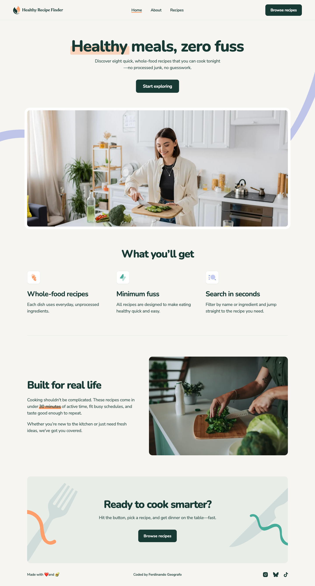
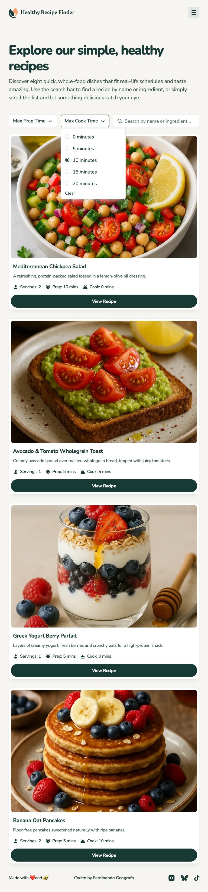
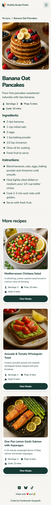

# Frontend Mentor - Recipe finder website solution

This is a solution to the [Recipe finder website challenge on Frontend Mentor](https://www.frontendmentor.io/challenges/recipe-finder-website--Ui-TZTPxN). Frontend Mentor challenges help you improve your coding skills by building realistic projects.

## Table of contents

- [Overview](#overview)
  - [The challenge](#the-challenge)
  - [Application behaviour](#application-behaviour)
  - [Screenshot](#screenshot)
  - [Links](#links)
- [My process](#my-process)
  - [Built with](#built-with)
  - [What I learned](#what-i-learned)
  - [Useful resources](#useful-resources)
  - [AI Collaboration](#ai-collaboration)
- [Author](#author)

## Overview

### The challenge

Users should be able to:

- View the Home, About, Recipes index and Recipe Details pages.
- Search for recipes by name or ingredient.
- Filter recipes by maximum prep or cook time.
- View the optimal layout for their device's screen size.
- See hover and focus states for interactive elements.
- Navigate the menus and recipe links with the keyboard.

### Application behaviour

- Search ignores case and surrounding whitespace; prep and cook limits combine and are inclusive, zero minutes included.
- Filters live in the URL (`q`, `maxPrep`, `maxCook`), so refresh, shared links and browser Back restore them.
- The static dataset is treated as a recipes API: it loads once and is shared by the index, the details and the related recipes. Responses slower than 200 ms show skeletons.
- Empty results, request errors with retry and unknown recipes have dedicated states.
- Menus, filters and links work with the keyboard. Page changes, retry and "Clear all filters" move focus to the page heading.
- Sections fade up once as they reach the viewport; reduced motion turns every animation off.
- A Netlify `_redirects` rule serves the app for deep links and refreshes.

Recipe card titles stay complete, and search results follow the actual dataset rather than the illustrative results in the design.

### Screenshot

<!-- Add the final screenshots, for example:



-->

### Links

- Solution URL: [GitHub Repository](https://github.com/FerdinandoGeografo/recipe-finder-website)
- Live Site URL: [Recipe Finder](#)

## My process

### Built with

- Semantic HTML5 markup
- CSS custom properties
- SASS / SCSS | BEM
- CSS Grid, Flexbox and container-relative units
- Mobile-first workflow
- Native CSS animations via `animate.enter` / `animate.leave`
- View Transitions API for route changes
- Intersection Observer API for the viewport reveal
- Responsive images with `NgOptimizedImage`, `srcset` and `sizes`
- [TypeScript](https://www.typescriptlang.org/) - JS superset
- [Angular (v22)](https://angular.dev/) - Frontend Typescript Framework
- [Angular Material & CDK](https://material.angular.dev/) - UI Components libraries
- [RxJS](https://rxjs.dev/) - For the viewport reveal stream and router events

### What I learned

I kept my usual feature-based structure: `home`, `about` and `recipes` hold the routed pages and their `ui` folder, with `data-access`, `types`, `constants` and `utils` beside them; `shared` follows the same layout. Routed pages own the state, while presentational components only receive inputs and emit outputs.

#### A shared resource store

A single `RecipesStore`, declared with Angular 22's `@Service()`, loads the dataset with `httpResource`. Values are read behind `hasValue()`, because a failed resource throws, and retry simply calls `reload()`:

```ts
readonly recipes = computed(() => (this.resource.hasValue() ? this.resource.value() : []));
readonly isLoading = computed(() => this.status() === 'loading');
```

#### The URL as the filter state

Query parameters are bound to signal inputs, and the results are a `computed` over a pure filter function. There is no second filter state to keep in sync with the router:

```ts
readonly q = input('', { transform: parseQuery });
protected readonly recipes = computed(() => filterRecipes(this.store.recipes(), this.filter()));
```

#### Moving focus after navigation

A single-page app does not reload the document, so focus would stay on the clicked link, or fall back to `<body>` when that link was removed with the old page. Each page declares its heading, and a `PageFocus` service focuses it after every path change, so screen readers read the new title and Tab continues from the content:

```html
<h1 appPageHeading class="text-preset-2">Explore our simple, healthy recipes</h1>
```

#### Responsive layout and images

Components share Sass partials for breakpoints, gutters, the design's text presets and focus-ring mixins. Image masks that scale in the design use container-relative units, such as `border-radius: calc(100cqw * 12 / 1192)`.

Images whose small and large files share the same crop use `srcset` and `sizes` through `NgOptimizedImage`, so the browser picks a file by rendered width and pixel density. On a 1440px screen at 1x, the recipe list now downloads about 250 kB of images instead of 870 kB. Cropped images use `fill`, the largest images above the fold get `priority`, and the rest load lazily.

#### Loading and motion

Skeletons fade in only after 200 ms, so fast responses never flash a placeholder, and their pulse animates the background colour to leave opacity free for that entrance:

```scss
animation:
  fade-in var(--motion-standard) var(--motion-ease-out) var(--motion-loading-delay) both,
  skeleton-pulse 1.2s ease-in-out infinite alternate;
```

`animate.enter` / `animate.leave` handle content that is created or removed, and View Transitions handle page changes. Sections already in the DOM reveal through an `appReveal` directive: a shared `IntersectionObserver` feeds a single-shot stream that also completes on focus or reduced motion, and the directive reads it with `toSignal`, so destroying it stops the observation:

```ts
protected readonly state = toSignal(
  inject(RevealObserver).reveal(inject<ElementRef<HTMLElement>>(ElementRef).nativeElement),
  { initialValue: 'pending' },
);
```

I considered `@defer (on viewport)` too, but deferred content is not in the DOM until reached: Tab would skip its links and find-in-page could not match its text. With the directive, content stays in the DOM and keyboard focus shows it at once.

### Useful resources

- [Reactive data fetching with httpResource](https://angular.dev/guide/http/http-resource) - Resource state, guarded value reads and reactive HTTP requests.
- [Common routing tasks](https://angular.dev/guide/routing/common-router-tasks) - Binding route and query parameters to component inputs.
- [Angular Material menus](https://material.angular.dev/components/menu/overview) - Menu items, keyboard behaviour and focus management.
- [Route transition animations](https://angular.dev/guide/routing/route-transition-animations) - The router's View Transitions integration.
- [Enter and Leave animations](https://angular.dev/guide/animations) - Native CSS animations with `animate.enter` / `animate.leave`.
- [Deferrable views](https://angular.dev/guide/templates/defer) - The `on viewport` trigger I compared with the reveal directive.
- [Image optimization](https://angular.dev/guide/image-optimization) - `NgOptimizedImage`, `fill`, `priority` and custom `srcset`.
- [Intersection Observer API](https://developer.mozilla.org/en-US/docs/Web/API/Intersection_Observer_API) - Root margins and entry geometry for the viewport reveal.
- [Angular deployment](https://angular.dev/tools/cli/deployment#routed-apps-must-fall-back-to-indexhtml) - Serving routed applications with an `index.html` fallback.

### AI Collaboration

I used Claude Code and Codex as pair programmers for the reviews and visual polish.

- **Planning first**: each larger change (the Angular 22 upgrade, the responsive pages, the filters, the final review) started from a plan with the problem, the alternatives and the files involved, and went on its own `feature/*` branch with small commits I tested locally.
- **Reviews**: audits of keyboard navigation, focus, loading states, reduced motion and forced colors, plus hunts for duplicated styles and helpers. Scripted browser runs, kept outside the repository, compared styles and geometry before and after each refactor.
- **Context in local files**: a project file with stack, design measurements and decisions, and an `AGENTS.md` with the working rules for any coding agent.

## Author

- Frontend Mentor - [@FerdinandoGeografo](https://www.frontendmentor.io/profile/FerdinandoGeografo)
- LinkedIn - [@FerdinandoGeografo](https://www.linkedin.com/in/ferdinandogeografo/)
- GitHub - [@FerdinandoGeografo](https://github.com/FerdinandoGeografo/)
